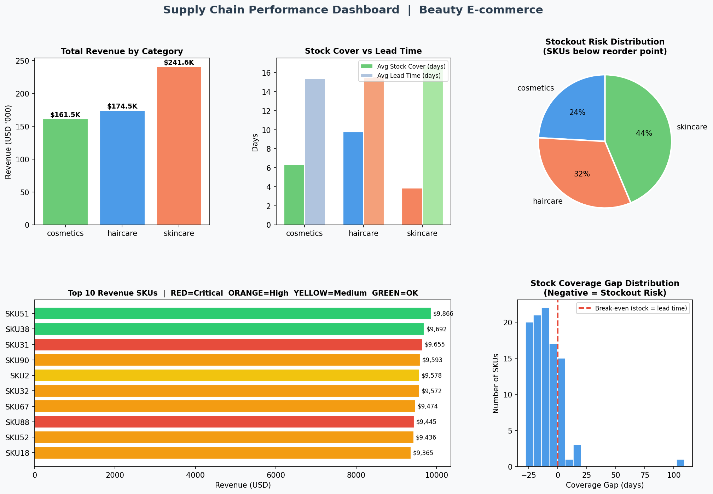
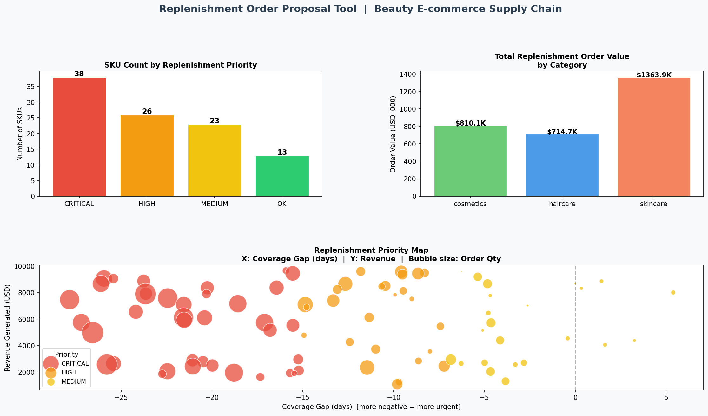
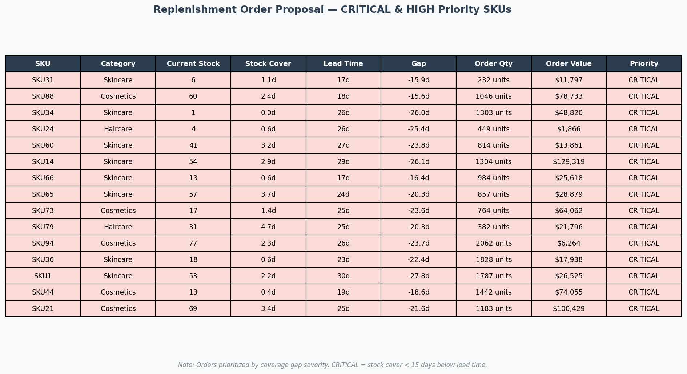
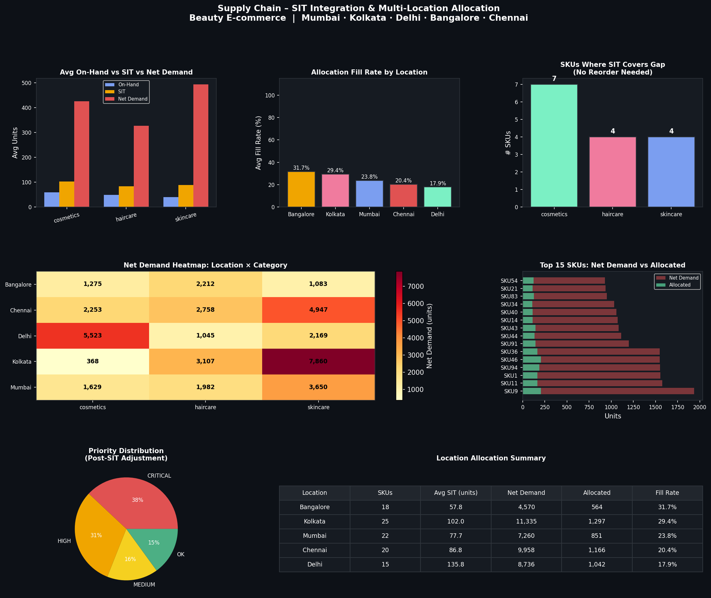

# Supply Chain Demand & Inventory Analysis

## Overview
An end-to-end supply chain analysis of a beauty e-commerce dataset (100 SKUs across skincare, haircare, and cosmetics), focused on demand planning, replenishment risk, and multi-location stock allocation across 5 customer delivery locations (Mumbai, Kolkata, Delhi, Bangalore, Chennai).

Includes an automated Net Demand model integrating Stock-in-Transit (SIT), a prioritized replenishment order proposal generator (Critical/High/Medium), and a location allocation engine with fill rate tracking.

## Objectives
- Identify SKUs where stock cover falls below reorder point (stockout risk)
- Integrate Stock-in-Transit (SIT) into Net Demand to avoid over-ordering
- Generate executable allocation proposals across 5 customer locations
- Compare revenue performance and replenishment priority across categories
- Surface supplier quality signals via defect rate analysis

## Key Findings
- **87% of SKUs** fall below reorder point, a systemic under-stocking issue relative to supplier lead times, not isolated cases
- **Skincare** drives the highest revenue ($241K) yet carries 95% stockout risk, top replenishment priority despite strong sales performance
- **$2.88M** in replenishment value identified; 38 SKUs flagged CRITICAL (stock runs out before next shipment if no action is taken)
- **SIT integration** removes reorder need for 15 SKUs, preventing excess stock build across categories
- **85 SKUs** require replenishment after SIT netting (vs. 87 pre-SIT)
- **Fill rate by location:** Bangalore 31.7% | Kolkata 29.4% | Mumbai 23.8% | Chennai 20.4% | Delhi 17.9% - low fill rates reflect constrained Order_quantities pool relative to Net Demand
- **Note on fill rates:** Low fill rates (17–32%) reflect a structural constraint in the dataset: Order_quantities (the available replenishment pool) average ~49 units/SKU while Net Demand averages ~400 units/SKU. 
> This gap is the core insight: current order volumes are insufficient to cover demand, which is the business problem this analysis is designed to surface and quantify.

## Dashboards
### Performance Dashboard

### Replenishment Order Proposal

### SIT Integration & Multi-Location Allocation

## Planning Logic
| Metric | Formula |
|---|---|
| Daily Sales Rate | Units Sold / 30 |
| Safety Stock | Daily Sales Rate × (Lead Time × 0.5) |
| Reorder Point | (Daily Sales Rate × Lead Time) + Safety Stock |
| Stock In Transit (SIT) | Daily Sales Rate × Shipping Time |
| **Net Demand** | **Target Stock − On-Hand Stock − SIT** |
| Order Quantity | Target Stock − Current Stock |
| Allocation | Net Demand distributed proportionally by location priority |

## Tools Used
- Python (Pandas, Matplotlib, NumPy)
- Dataset: Beauty e-commerce supply chain (Kaggle, 100 SKUs)

## Files
| File | Description |
|---|---|
| `supply_chain_analysis.py` | Base analysis + replenishment tool |
| `sit_allocation.py` | SIT integration + multi-location allocation |
| `supply_chain_dashboard.png` | Performance overview dashboard |
| `replenishment_proposal.png` | Replenishment order proposal charts |
| `replenishment_table.png` | Replenishment order proposal table |
| `sit_allocation_dashboard.png` | SIT & allocation dashboard |
| `allocation_proposal.csv` | Executable allocation output by location |
| `supply_chain_data.csv` | Source dataset |

## Author
Tran Nguyen Phuong Anh  
[LinkedIn](http://www.linkedin.com/in/anntran187) | tranng.phuonganh027@gmail.com
